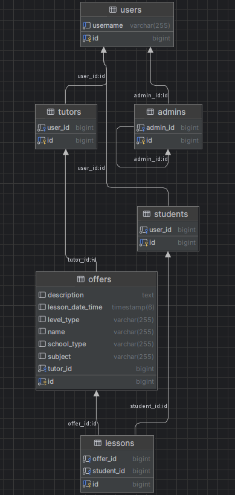
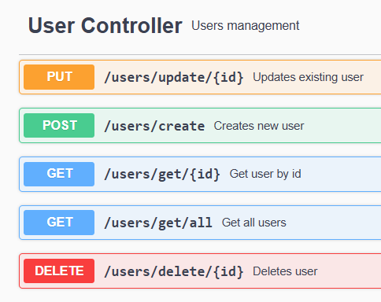
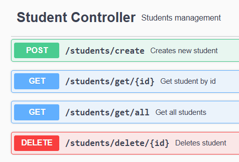
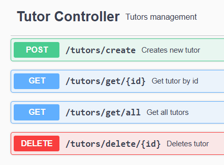
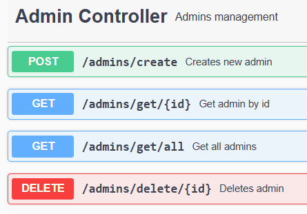
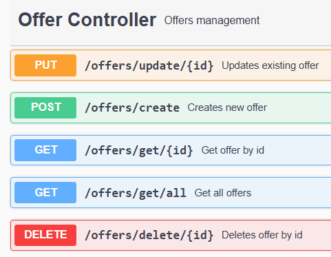
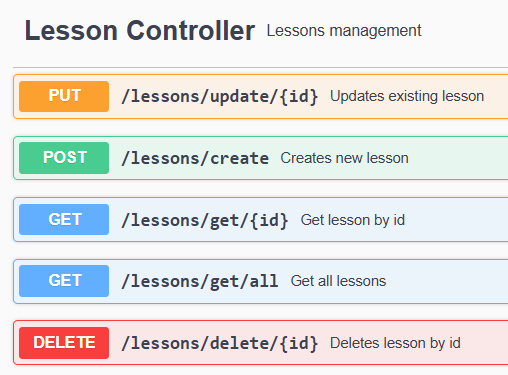
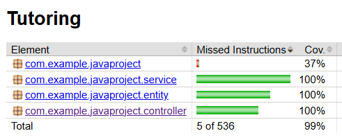

# 📚 Tutoring Platform

Platform where **tutors can post lesson offers** and **students can book lessons**. Built with **Spring Boot**, **PostgreSQL**, and **Hibernate/JPA**.

---

## ✨ Features

### For Tutors:
- Post tutoring offers for different school types at diffrent levels

### For Students:
- Browse available offers
- Book lessons with tutors

---

## 🛠 Tech Stack

- **Backend:** Spring Boot, Java 17
- **Database:** PostgreSQL
- **JPA/Hibernate:** for ORM and schema generation
- **Build Tool:** Maven
- **Validation:** Jakarta Validation (Hibernate Validator)

---

## ⚙️ Getting Started

### Prerequisites

- Java 17+
- PostgreSQL
- Maven

### Database Setup

1. Create PostgreSQL user and database:
   ```sql
   CREATE DATABASE tutoring;
   CREATE USER user WITH PASSWORD 'your_password';
   GRANT ALL PRIVILEGES ON DATABASE tutroing TO user;
   
2. **ERD** Diagram
   

## 👤 Users

Every user is stored in `users` table. Users are spread accros 3 roles each witch its own table and logic

- Students

- Tutors

- Admins


## 🧑‍🏫 Creating offers
Tutors may create **offers** with help of `OfferController`


Each offer requires info about:
- Name of the offer
- Subject that tutor teaches (eg. Math, Physics, etc.
- School type (Podstawowa, Srednia, Studia)
- Level type (Podstawa, Rozszerzenie)
- Brief description
- Date and time of the lesson

## 📝 Booking lessons
Students may book lessons with tutors based on their offers. `LessonControler` provides API for choosing 
offer that we are interested in.


Each lesson saves student data and info about offer posted by a tutor.


## 📈 Tests
Below JaCoCo report about code coverage with unit and integration tests
